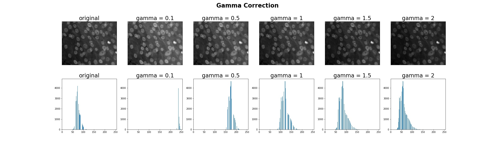
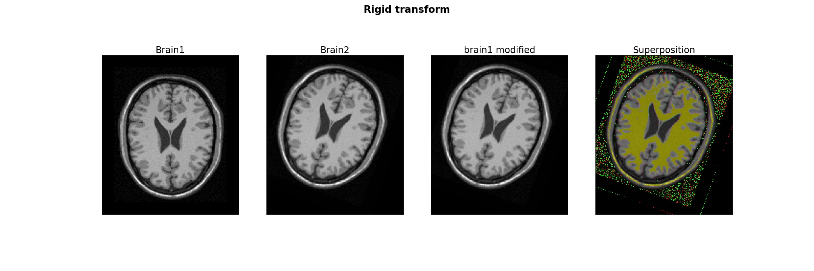
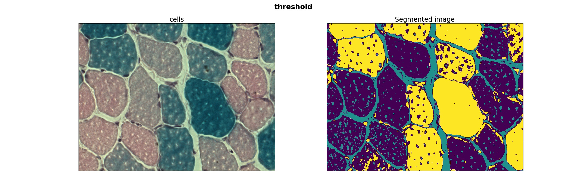
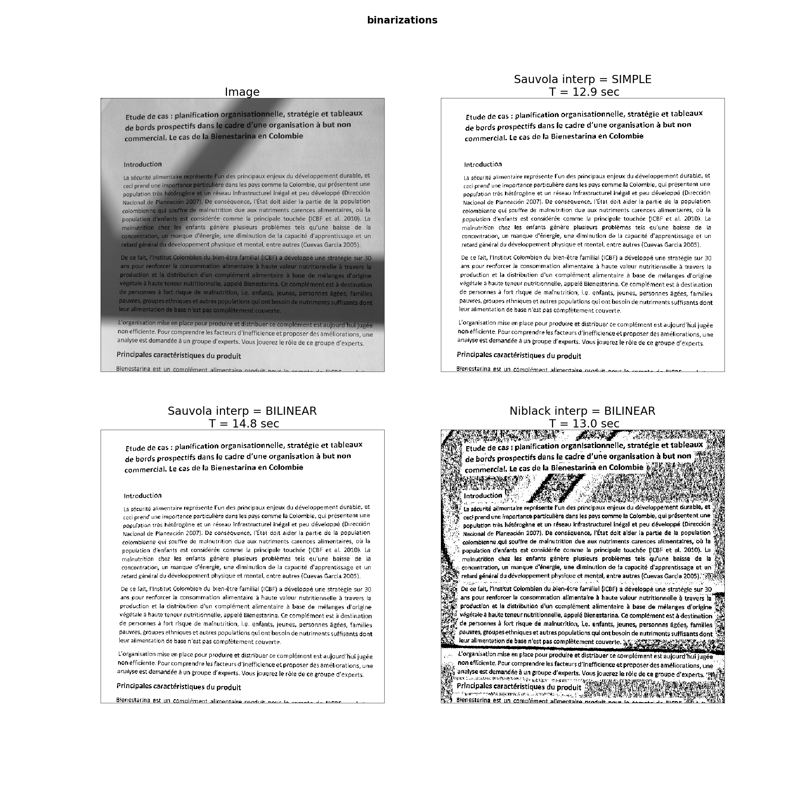

# Image processing

Different image processing function are here used on various medical images.
- Enhancement and restoration
- Morphology
- registration
- segmentation
- characterisation

### The final project was about coding a Sauvola binarization algorithm.
   